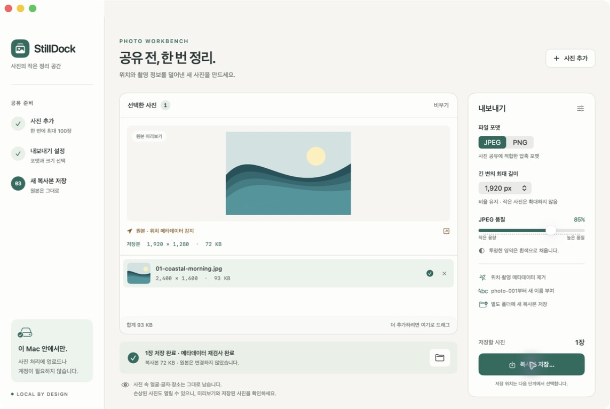

# StillDock

**사진을 공유하기 전, 복사본부터 정리하세요.**

StillDock is a small, offline macOS workbench for preparing images to share. Keep your originals, choose a size and format, and export new copies with a metadata check.



## What it does

- Import JPEG, PNG, HEIC and HEIF still images in batches of up to 100.
- Export JPEG or PNG with an optional maximum edge of 1280, 1920 or 2560 pixels, without upscaling.
- Apply orientation to the pixels and create a fresh sRGB image without copying source GPS, EXIF, IPTC or XMP information.
- Reopen every output and check its dimensions, format and metadata before reporting success.
- Use neutral sequential names in a new output folder; existing files and original images are never overwritten.
- Show individual results, output sizes, cancellation progress and a shortcut to Finder.

No account, advertising, analytics, network requests or third-party runtime dependencies.

## Limits you can see

Faces, addresses, documents and other visible content in a photo remain visible. This app does not redact images or promise anonymity. Output retains technical information needed to display an image, such as dimensions and a generic color profile. Exports use 8-bit sRGB SDR, and JPEG is recompressed; output may be larger than the original. JPEG transparency is flattened on white, while PNG preserves alpha. Animated images, RAW, Live Photo pairs, depth data and HDR preservation are outside this release. Each input must be at most 100 megapixels and 512 MiB. Apple's decoder may recover part of a damaged source image; review the preview and resulting copy. Validation confirms the exported file is decodable and meets the metadata policy, not that the original was undamaged.

## Install

Requires macOS 14 or later on an Apple silicon or Intel Mac. See the release's validation notes for its exact signing and notarization state. Download the DMG from [Releases](https://github.com/controlguy-ys/StillDock/releases), open it, and drag StillDock into Applications. The initial developer preview is ad hoc signed and not notarized; Gatekeeper may prevent opening a downloaded copy. A Developer ID and notarized release is pending.

## Use

1. Click **사진 추가** or press **⌘O** to choose images. Files can also be dropped into the workbench.
2. Choose JPEG or PNG and the maximum edge. Review the source metadata indicator.
3. Choose an output folder and export. StillDock creates a separate folder of numbered copies.
4. Check the individual results and open the output in Finder.

## Build and verify

Xcode 16 or later, Swift 6 toolchain and [XcodeGen](https://github.com/yonaskolb/XcodeGen) are required. The application targets macOS 14 and uses Swift 5 language mode.

```sh
export DEVELOPER_DIR=/Applications/Xcode.app/Contents/Developer
swift test
swift scripts/make-assets.swift
iconutil -c icns build/AppIcon.iconset -o Resources/AppIcon.icns
bash scripts/build.sh
```

The local build uses an ad hoc signature for development. Public distribution requires a Developer ID signature and Apple notarization; those are separate from compilation.

See [product research](docs/research.md), [implementation plan](docs/plan.md), [privacy](PRIVACY.md), [release notes](docs/releases.json), and [validation](docs/validation.md).
